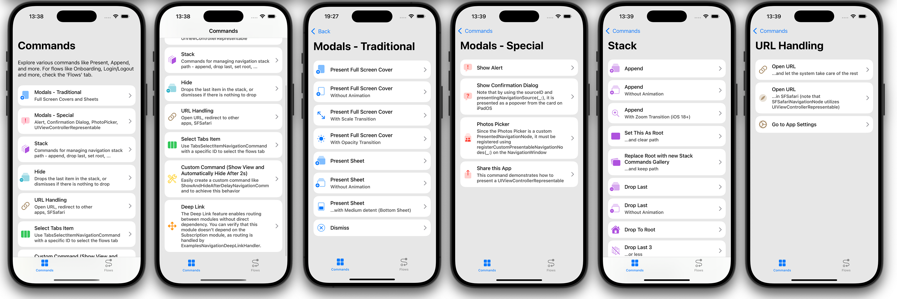
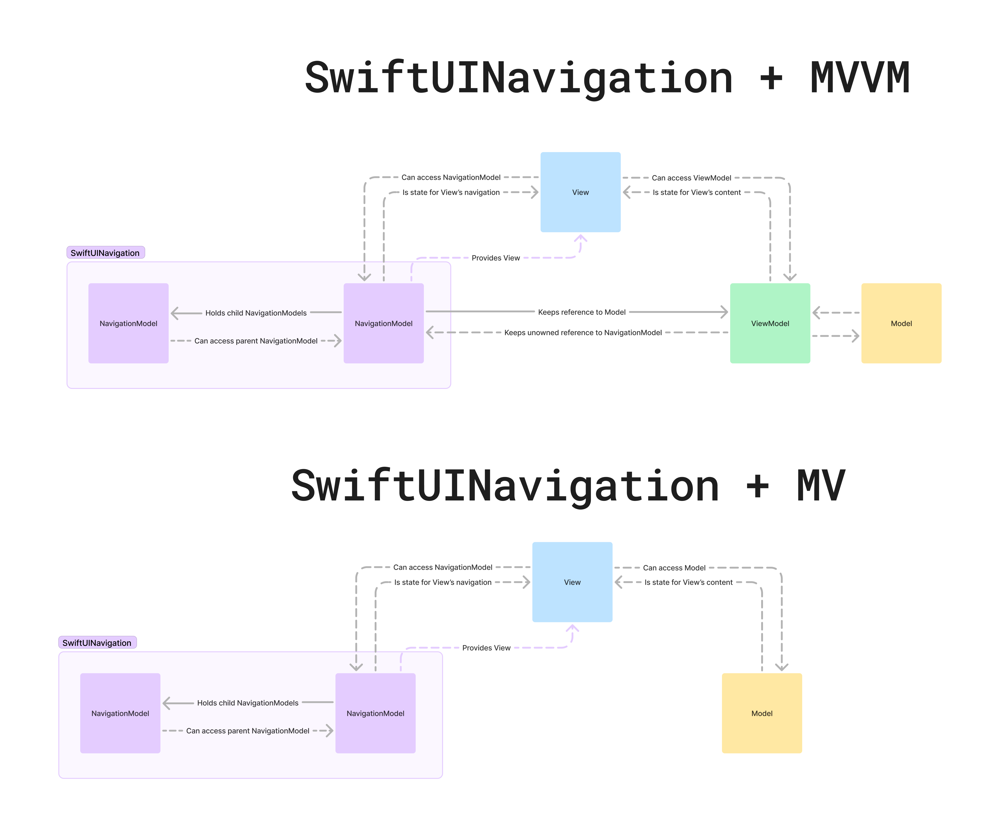

# SwiftUINavigation

Framework for Implementing Clean Navigation in SwiftUI


If anything is unclear, feel free to reach out! I'm happy to clarify or update the documentation to make things more straightforward. 🚀

If you find this repository helpful, feel free to give it a ⭐ or share it with your colleagues 👩‍💻👨‍💻 to help grow the community of developers using this framework!

- 🚀 [Features](#Features)
- 💡 [Core Idea - `NavigationModel`](#core-idea---navigationmodel)
- 🚦 [Getting Started](#Getting-Started)
- 📚 [Documentation](#Documentation)

---------

## Features

- ✅ Handles both simple concepts, like presenting/stack navigation, and complex concepts, such as content-driven (deep linking) and step-by-step navigation ([See Examples app](#Explore-Examples-App))
- ✅ Built on native SwiftUI components, leveraging state-driven architecture in the background
- ✅ Clearly separates the navigation and presentation layers
- ✅ Compatible with modular architecture
- ✅ Perfect for everything from simple apps to large-scale projects
- ✅ You can choose any architecture that fits your needs—MV, MVVM, or even TCA
- ✅ Fully customizable and extendable to fit your specific needs
- ✅ Inspired by the well-known Coordinator pattern but without the hassle of manually managing parent-child relationships
- ✅ Supports iOS 16 and later
- ✅ Supports custom `fullScreenCover` transitions (e.g., `scale`, `opacity`) from iOS 17 and stack transitions (e.g., `zoom`) from iOS 18
- ✅ Supports iPadOS 16, macOS 13, and Mac Catalyst 16 as well – optimized for multi-window experiences 
- ✅ Enables calling environment actions, such as `requestReview`
- ✅ Supports backward compatibility with UIKit via `UIViewControllerRepresentable` – easily present `SFSafariViewController` or `UIActivityViewController`
- ✅ Supports Swift 6 and is concurrency safe




## Core Idea - `NavigationModel` 

In SwiftUI, `State`/`Model`/`ViewModel` serves as the single source of truth for the view's content. This framework separates the state of navigation into a dedicated model called `NavigationModel`.

Think of it as a screen/module or what you might recognize as a coordinator or router. These `NavigationModels` form a navigation graph, where each `NavigationModel` maintains its own state using `@Published` properties. This state is rendered using native SwiftUI mechanisms, and when the state changes, navigation occurs. 

For example, when you update `presentedModel`, the corresponding view for the new `presentedModel` is presented. The `NavigationModel` is also responsible for providing the screen's content within its `body`, which is then integrated into the view hierarchy by the framework.

Below is a diagram illustrating the relationships between components when using `SwiftUINavigation` alongside MVVM or MV architecture patterns:



`NavigationCommand` represents an operation that modifies the navigation state of `NavigationModel`. For example, a `PresentNavigationCommand ` sets the `presentedModel`. These operations can include actions like `.stackAppend(_:animated:)` (push), `.stackDropLast(_:animated:)` (pop), `.present(_:animated:)`, `.dismiss(animated:)`, `.openURL(_)` and more.

To get started, I recommend exploring the [Examples app](#Explore-Examples-App) to get a feel for the framework. Afterward, you can dive deeper [on your own](#Explore-on-Your-Own). For more detailed information, check out the [Documentation](#Documentation).

## Getting Started

I highly recommend starting by exploring the [Examples app](#Explore-Examples-App). The app features many commands that you can use to handle navigation, as well as showcases common flows found in many apps. It includes everything from easy login/logout flows to custom navigation bars with multiple windows.

If you prefer to explore the framework on your own, check out [Explore on Your Own](#Explore-on-Your-Own) and the [Documentation](#Documentation).

### Explore Examples App

<details>
<summary>Click to see details 👈</summary>

#### Read This First

- The app is modularized using SPM to demonstrate its compatibility with a modular architecture. However, when integrating it into your app, you can keep everything in a single module if you prefer.  
- Some modules follow the MV architecture, while others with a ViewModel use MVVM. The choice of architecture is entirely up to you—SwiftUINavigation solely provides a solution for the navigation layer.  
- Dependencies for `NavigationModel`s are handled via initializers. To avoid passing them in every init, you can use a dependency manager like [swift-dependencies](https://github.com/pointfreeco/swift-dependencies). 
- There is a `Shared` module that contains e.g. objects for deep linking, which can be used across any module. Implementations of certain services are located in the main app within the `Dependencies` folder.  
- The `ActionableList` module serves as a generic module for list screens with items. To see what items each list contains, check the implementation of factories in the module’s `Data/Factories/...` folder.  

#### Installation

1. Get the repo

    - Clone the repo: `git clone https://github.com/RobertDresler/SwiftUINavigation`
    - Download the repo (don't forget to **rename** the downloaded folder to `SwiftUINavigation`)

2. Open the app at path `SwiftUINavigation/Examples.xcodeproj`

3. Run the app

    - On simulator
    - On a real device (set your development team)

4. Explore the app

</details>

### Explore on Your Own

<details>
<summary>Click to see details 👈</summary>

To get started, first add the package to your project:

- In Xcode, add the package by using this URL: `https://github.com/RobertDresler/SwiftUINavigation` and choose the dependency rule **up to next major version** from `2.2.0`
- Alternatively, add it to your `Package.swift` file: `.package(url: "https://github.com/RobertDresler/SwiftUINavigation", from: "2.2.0")`

Once the package is added, you can copy this code and begin exploring the framework by yourself:

**MV**
<details>
<summary>Click to view the example code 👈</summary>

```swift
import SwiftUI
import SwiftUINavigation

@main
struct YourApp: App {

    @StateObject private var rootNavigationModel = DefaultStackRootNavigationModel(
        HomeNavigationModel()
    )

    var body: some Scene {
        WindowGroup {
            RootNavigationView(rootModel: rootNavigationModel)
        }
    }

}

@NavigationModel
final class HomeNavigationModel {

    var body: some View {
        HomeView()
    }

    func showDetail(onRemoval: @escaping () -> Void) {
        let detailNavigationModel = DetailNavigationModel()
            .onMessageReceived { message in
                switch message {
                case _ as FinishedNavigationMessage:
                    onRemoval()
                default:
                    break
                }
            }
        execute(.present(.sheet(.stacked(detailNavigationModel))))
    }

}

struct HomeView: View {

    @EnvironmentNavigationModel private var navigationModel: HomeNavigationModel
    @State private var dismissalCount = 0

    var body: some View {
        VStack {
            Text("Hello, World from Home!")
            Text("Detail dismissal count: \(dismissalCount)")
            Button(action: { showDetail() }) {
                Text("Go to Detail")
            }
        }
    }

    func showDetail() {
        navigationModel.showDetail(onRemoval: { dismissalCount += 1 })
    }

}

@NavigationModel
final class DetailNavigationModel {

    var body: some View {
        DetailView()
    }

}

struct DetailView: View {

    @EnvironmentNavigationModel private var navigationModel: DetailNavigationModel

    var body: some View {
        Text("Hello world from Detail!")
    }

}
```

</details>

**MVVM**
<details>
<summary>Click to view the example code 👈</summary>

```swift
import SwiftUI
import SwiftUINavigation

@main
struct YourApp: App {

    @StateObject private var rootNavigationModel = DefaultStackRootNavigationModel(
	HomeNavigationModel()
    )

    var body: some Scene {
        WindowGroup {
            RootNavigationView(rootModel: rootNavigationModel)
        }
    }

}

@NavigationModel
final class HomeNavigationModel {

    private lazy var viewModel = HomeViewModel(navigationModel: self)

    var body: some View {
        HomeView(viewModel: viewModel)
    }

    func showDetail() {
        let detailNavigationModel = DetailNavigationModel()
            .onMessageReceived { [weak self] message in
                switch message {
                case _ as FinishedNavigationMessage:
                    self?.viewModel.dismissalCount += 1
                default:
                    break
                }
            }
        execute(.present(.sheet(.stacked(detailNavigationModel))))
    }

}

@MainActor class HomeViewModel: ObservableObject {

    @Published var dismissalCount = 0
    private unowned let navigationModel: HomeNavigationModel

    init(dismissalCount: Int = 0, navigationModel: HomeNavigationModel) {
        self.dismissalCount = dismissalCount
        self.navigationModel = navigationModel
    }

}

struct HomeView: View {

    @EnvironmentNavigationModel private var navigationModel: HomeNavigationModel
    @ObservedObject var viewModel: HomeViewModel

    var body: some View {
        VStack {
            Text("Hello, World from Home!")
            Text("Detail dismissal count: \(viewModel.dismissalCount)")
            Button(action: { navigationModel.showDetail() }) {
                Text("Go to Detail")
            }
        }
    }

}

@NavigationModel
final class DetailNavigationModel {

    private lazy var viewModel = DetailViewModel(navigationModel: self)

    var body: some View {
        DetailView(viewModel: viewModel)
    }

}

@MainActor class DetailViewModel: ObservableObject {

    private unowned let navigationModel: DetailNavigationModel

    init(navigationModel: DetailNavigationModel) {
        self.navigationModel = navigationModel
    }

}

struct DetailView: View {

    @EnvironmentNavigationModel private var navigationModel: DetailNavigationModel
    @ObservedObject var viewModel: DetailViewModel

    var body: some View {
        Text("Hello world from Detail!")
    }

}
```

</details>

</details>

## Documentation

To see the framework in action, check out the code in the [Examples App](#Explore-Examples-App). If anything is unclear, feel free to reach out! I'm happy to clarify or update the documentation to make things more straightforward. 🚀

### RootNavigationView
<details>
<summary>Click here to see more 👈</summary>
The `RootNavigationView` is the top-level hierarchy element. It is placed inside a `WindowGroup` and holds a reference to the root `NavigationModel`. Avoid nesting one `RootNavigationView` inside another—use it only at the top level.  

The only exception is when integrating `SwiftUINavigation` into an existing project that uses UIKit-based navigation. In this case, `RootNavigationView` allows you to bridge between SwiftUI and UIKit navigation patterns.

The root model should be created using the `@StateObject` property wrapper, for example, in your `App`:

```swift
@main
struct YourApp: App {

    @StateObject private var rootNavigationModel = DefaultStackRootNavigationModel(HomeNavigationModel())

    var body: some Scene {
        WindowGroup {
            RootNavigationView(rootModel: rootNavigationModel)
        }
    }

}
```
</details>

### NavigationModel
<details>
<summary>Click here to see more 👈</summary>

A `NavigationModel` represents a single model in the navigation graph, similar to what you might know as a Coordinator or Router. You typically have one `NavigationModel` for each module or screen. A `NavigationModel` manages the navigation state for the certain module.

In `body`, you return the implementation of your module’s view.

The minimal working example is shown below. If you support iOS 17+, `YourModel` can use the `@Observable` macro instead. In that case, you would assign it as an environment value in `body` rather than passing it in the initializer.

**MVVM:**

```swift
@NavigationModel
final class YourNavigationModel {

    private lazy var viewModel = YourViewModel(navigationModel: self)

    var body: some View {
        YourView(viewModel: viewModel)
    }

}

@MainActor class YourViewModel: ObservableObject {

    private unowned let navigationModel: YourNavigationModel

    init(navigationModel: YourNavigationModel) {
        self.navigationModel = navigationModel
    }

}

struct YourView: View {

    @EnvironmentNavigationModel private var navigationModel: YourNavigationModel
    @ObservedObject var viewModel: YourViewModel

    var body: some View {
        Text("Hello, World from Your Module!")
    }

}
```

**MV:**

```swift
@NavigationModel
final class YourNavigationModel {

    var body: some View {
        YourView()
    }

}

struct YourView: View {

    @EnvironmentNavigationModel private var navigationModel: YourNavigationModel

    var body: some View {
        Text("Hello, World from Your Module!")
    }

}
```

#### Predefined Macros:

Keep in mind that any property of a class marked with one of these macros, which is settable (`var`) and is not lazy, is automatically marked as `@Published`.

- **`@NavigationModel`**  
  The simplest Model you’ll use most of the time, especially if your screen doesn’t require any tabs or switch logic. You will also use this macro if you want to create your own container model.
  
- **`@StackRootNavigationModel`**  
  Represents what you would typically associate with a `NavigationStack` or `UINavigationController` container. Most of the time, you don't have to create your own implementation; you can use the predefined container model `.stacked` / `DefaultStackRootNavigationModel` like this:
  
  ```swift
  .stacked(HomeNavigationModel())
  ```
  
  If you want to create your own implementation, you can update the Model's body using `body(for:)`.

- **`@TabsRootNavigationModel`**  
  Represents what you would typically associate with a `TabView` or `UITabBarController` container. You can create your own implementation of `TabsRootNavigationModel` like this (for more, see [Examples App](#Explore-Examples-App)):
    
```swift
@TabsRootNavigationModel
final class MainTabsNavigationModel {

    enum Tab {
        case home
        case settings
    }

    var selectedTabModelID: AnyHashable
    var tabsModels: [any TabModel]

    init(initialTab: Tab) {
        selectedTabModelID = initialTab
        tabsModels = [
            DefaultTabModel(
                id: Tab.home,
                image: Image(systemName: "house"),
                title: "Home",
                navigationModel: .stacked(HomeNavigationModel())
            ),
            DefaultTabModel(
                id: Tab.settings,
                image: Image(systemName: "gear"),
                title: "Settings",
                navigationModel: .stacked(SettingsNavigationModel())
            )
        ]
    }

    func body(for content: TabsRootNavigationModelView<MainTabsNavigationModel>) -> some View {
        content // Modify default content if needed
    }

}
```

- **`@SwitchedNavigationModel`**    
  Use this macro to create a `NavigationModel` container that can dynamically switch between different child Models.  

  This `NavigationModel` is useful for scenarios like:  
  - A root `NavigationModel` that displays either the tabs root `NavigationModel` or the login `NavigationModel` based on whether the user is logged in.  
  - A subscription `NavigationModel` that shows different content depending on whether the user is subscribed.  
  - And more...

  See the example below, or for a practical implementation, check out the [Examples App](#Explore-Examples-App).
  
```swift
final class UserService {
    @Published var isUserLogged = false
}

@SwitchedNavigationModel
final class AppNavigationModel {

    var switchedModel: (any NavigationModel)?
    let userService: UserService

    init(userService: UserService) {
        self.userService = userService
    }

    func body(for content: SwitchedNavigationModelView<AppNavigationModel>) -> some View {
        content
            .onReceive(userService.$isUserLogged) { [weak self] in self?.switchModel(isUserLogged: $0) }
    }

    private func switchModel(isUserLogged: Bool) {
        execute(
            .switchModel(
                isUserLogged
                    ? MainTabsNavigationModel(initialTab: .home)
                    : LoginNavigationModel()
            )
        )
    }

}
```

#### Predefined Models:

- **`.stacked`/`DefaultStackRootNavigationModel`**  
  A generic `@StackRootNavigationModel` container that you can use in most cases without needing to create your own. You can create it using either by using `DefaultStackRootNavigationModel` or with its static `.stacked` getters.

  ```swift
  @main
  struct YourApp: App {

      @StateObject private var rootNavigationModel = DefaultStackRootNavigationModel(HomeNavigationModel())

      var body: some Scene {
          WindowGroup {
              RootNavigationView(rootModel: rootNavigationModel)
          }
      }

  }

  ... in the app
  
  execute(.present(.sheet(.stacked(DetailNavigationModel()))))
  ```
  
  - You can also pass `StackTabBarToolbarBehavior` as an argument like this:  
`.stacked(..., tabBarToolbarBehavior: .hiddenWhenNotRoot(animated: false))`. This will hide the tab bar toolbar when the root view is not visible.
  	 - `.automatic` - Preserves the default behavior.
  	 - `.hiddenWhenNotRoot(animated:)` - Hides the tab bar when the root view is not visible - could be animated or not.
  
- **`SFSafariNavigationModel`**  
  A Model that opens a URL in an in-app browser.

</details>
  
### NavigationModel's State
<details>
<summary>Click here to see more 👈</summary>

Each Model maintains its state as `@Published` properties inside `NavigationModel`. By using any of the navigation Model macros, all settable properties (`var`) that are not lazy are automatically marked with the `@Published` property wrapper, allowing you to observe these changes inside the `body`.

</details>

### NavigationCommand
<details>
<summary>Click here to see more 👈</summary>

To perform common navigation actions like append, present, or dismiss, you need to modify the navigation state. In the framework, this is handled using `NavigationCommand`s. These commands allow you to dynamically update the state to reflect the desired navigation flow. Many commands are already predefined within the framework (see [Examples App](#Explore-Examples-App)).

A command is executed on a `NavigationModel` using the `execute(_:)` method:

```swift
@NavigationModel
final class HomeNavigationModel {

    ...

    func showDetail() {
        execute(.present(.sheet(.stacked(DetailNavigationModel()))))
    }

}
```

#### Predefined Commands

##### Stack Commands
- **`.stackAppend`/`StackAppendNavigationCommand`**  
  Adds a new `NavigationModel` to the stack - you can think of it as a push
- **`.stackDropLast`/`StackDropLastNavigationCommand`**  
  Hides the last `k` `NavigationModel`s in the stack - you can think of it as a pop
- **`.stackDropToRoot`/`StackDropToRootNavigationCommand`**  
  Leaves only the first `NavigationModel` in the stack - you can think of it as a pop to root
- **`.stackSetRoot`/`StackSetRootNavigationCommand`**  
  Replaces the root `NavigationModel` in the stack
- **`.stackMap`/`StackMapNavigationCommand`**  
  Changes the stack - you can create your own command using this one

##### Presentation Commands
- **`.present`/`PresentNavigationCommand`**  
  Presents a `NavigationModel` on the highest Model that can present
- **`PresentOnGivenModelNavigationCommand`**  
  Presents a `NavigationModel` on the specified Model

##### Dismiss Commands
- **`.dismiss`/`DismissNavigationCommand`**  
  Dismisses the highest presented Model
- **`DismissJustFromPresentedNavigationCommand`**  
  Dismisses the `NavigationModel` on which it is called, if it is the highest presented `NavigationModel`

##### Other Commands
- **`.hide`/`ResolvedHideNavigationCommand`**  
  Dismisses the `NavigationModel` if possible, otherwise drops the last `NavigationModel` in the stack
- **`.tabsSelectItem`/`TabsSelectItemNavigationCommand`**  
  Changes the selected tab in the nearest tab bar
- **`.switchModel`/`SwitchNavigationCommand`**  
  If the called `NavigationModel` is a `SwitchedNavigationModel`, it switches its `switchedModel`
- **`.openWindow`/`OpenWindowNavigationCommand`**  
  Opens a new window with ID
- **`.dismissWindow`/`DismissWindowNavigationCommand`**  
  Closes the window with ID
- **`.openURL`/`OpenURLNavigationCommand`**  
  Opens a URL using `NavigationEnvironmentTrigger` (see [NavigationEnvironmentTrigger](#NavigationEnvironmentTrigger))

The framework is designed to allow you to easily create your own commands as well (see [Examples App](#Explore-Examples-App)).

</details>

### PresentedNavigationModel
<details>
<summary>Click here to see more 👈</summary>

Since presenting views using native mechanisms requires separate view modifiers, this could lead to unintended scenarios where `fullScreenCover`, `sheet`, and `alert` are presented simultaneously (or at least this is what your declaration looks like). To address this, I introduced the concept of `PresentedNavigationModel`. Each `NavigationModel` internally maintains a single `presentedModel` property.

Instead of presenting a `NavigationModel` directly, you present only one `PresentedNavigationModel`, which holds your `NavigationModel` (e.g., `DetailNavigationModel`). The `PresentedNavigationModel` could be for example `FullScreenCoverPresentedNavigationModel` representing model which gets presented as `fullScreenCover`.

This approach also allows for custom implementations, such as a photo picker. To present a model, execute `PresentNavigationCommand` with the `PresentedNavigationModel`.  

```swift
@NavigationModel
final class ProfileNavigationModel {

    ...

    func showEditor() {
        // Present fullScreenCover
        execute(.present(.fullScreenCover(.stacked(ProfileEditorNavigationModel()))))
        // Present fullScreenCover with opacity transition
        execute(.present(.fullScreenCover(.stacked(ProfileEditorNavigationModel()), transition: .opacity.animation(.default))))
        // Present sheet
        execute(.present(.sheet(.stacked(ProfileEditorNavigationModel()))))
        // Present sheet with editor and pushed connected services detail from the editor
        execute(.present(.sheet(.stacked([ProfileEditorNavigationModel(), ConnectedServicesDetailNavigationModel()])))
        // Present not wrapped in stack
        execute(.present(.sheet(SFSafariNavigationModel(...))))
	// Present sheet and then immediately present another one
	let presentedModel = ProfileEditorNavigationModel()
        execute(.present(.sheet(.stacked(presentedModel))))
        presentedModel.execute(.present(.sheet(.stacked(NameEditorNavigationModel()))))
    }

}

struct ProfileView: View {

    @EnvironmentNavigationModel private var navigationModel: ProfileNavigationModel

    var body: some View {
        Button("Show editor") {
            navigationModel.showEditor()
        }
    }

}
```

#### Predefined PresentedNavigationModels
- **`.fullScreenCover`/`FullScreenCoverPresentedNavigationModel`**  
  Displays a full-screen modal, similar to `fullScreenCover` in SwiftUI. If you want to wrap a newly presented Model into a stack Model, use `.stacked` or `DefaultStackRootNavigationModel`. On iOS 17+ you can pass custom `transition`.
- **`.sheet`/`SheetPresentedNavigationModel`**  
  Displays a sheet, similar to `sheet` in SwiftUI (you can adjust the detents to show it as a bottom sheet). If you want to wrap a newly presented `NavigationModel` into a stack Model, use `.stacked` or `DefaultStackRootNavigationModel`.
- **`.alert`/`AlertPresentedNavigationModel`**  
  Presents a standard `alert`
- **`.confirmationDialog`/`ConfirmationDialogPresentedNavigationModel`**  
  Presents an alert as `actionSheet`

When presenting models like `ConfirmationDialogPresentedNavigationModel`, you may want to present it from a specific view, so that on iPad, it appears as a popover originating from that view. To do this, use the `presentingNavigationSource(_:)` modifier to modify the view:

```swift
Button(...) { ... }
    .presentingNavigationSource(id: "logoutButton")
```

Then, when presenting it, pass the 
`sourceID` to the command's `presentedModel`:

```swift
.present(
    .confirmationDialog(
        ...,
        sourceID: "logoutButton"
    )
)
```

You can also define your own custom presentable models, such as for handling a `PhotosPicker`. In this case, you need to register these models on the `NavigationWindow` using the `registerCustomPresentableNavigationModels(_:)` method (see [Examples App](#Explore-Examples-App)).

</details>
	
### NavigationMessage
<details>
<summary>Click here to see more 👈</summary>

A `NavigationModel` can send a `NavigationMessage` through a message listener. You can add the listener using `onMessageReceived(_:)`/`addMessageListener(_:)`, and then send the message using `sendMessage(_:)`. The recipient can then check which type of message it is and handle it accordingly.

```swift
execute(
    .stackAppend(
        DetailNavigationModel()
            .onMessageReceived { [weak self] in 
                switch message {
                case _ as FinishedNavigationMessage:
                    // You can handle it how you want, these are just examples
                    // When using MV you can call closure from method's argument
                    onDetailRemoval()
                    // When using MVVM you can access `viewModel` from your `NavigationModel`
                    self?.viewModel.handleDetailRemoval()
                default:
                    // Or you can do nothing
                    break
                } 
            }
    )
)
```

The framework provides a predefined message, `FinishedNavigationMessage`, which is triggered whenever a `NavigationModel` is finished (removed from its `parent`), so you know it is being deallocated, dismissed, or dropped from the stack.

</details>

### Deep Linking
<details>
<summary>Click here to see more 👈</summary>

Sometimes, you need content-driven navigation, such as when backend data or notifications direct users to specific screens. How you handle this data is entirely up to you.

The basic flow works as follows:

1. Receive a deep link—for example, from the backend after a notification is tapped.
2. Pass the deep link to a `NavigationModel`—for example, by creating a service that observes deep links in `AppNavigationModel` (as demonstrated in the [Examples App](#Explore-Examples-App)).
3. Handle the deep link in a specific `NavigationModel`—you can access properties like `children`, `presentedModel`, or cast `NavigationModel` to `TabsRootNavigationModel` to retrieve `tabsModels`.

An example approach is shown in the [Examples App](#Explore-Examples-App), where the `HandleDeepLinkNavigationCommandFactory` service resolves the custom `HandleDeepLinkNavigationCommand`. This allows developers to handle deep links according to their needs. The exact implementation of this flow is entirely up to you.

Here’s a simple example of how you can handle different deep links.

```swift
enum DeepLink {
    case detail(DetailInputData)
    case detailWithPushedEditor(DetailInputData, DetailEditorInputData)
    case detailWithPresentedEditor(DetailInputData, DetailEditorInputData)
}

@NavigationModel
final class AppNavigationModel {

    ...

    func handleDeepLink(_ deepLink: DeepLink) {
        switch deepLink {
        /// Present just detail as sheet
        case let .detail(detailInputData):
            let detailModel = DetailNavigationModel(inputData: detailInputData)
            execute(.present(.sheet(.stacked(detailModel))))
        /// Present detail as sheet with already pushed detail editor
        case let .detailWithPushedEditor(detailInputData, detailEditorInputData):
            let detailModel = DetailNavigationModel(inputData: detailInputData)
            let detailEditorModel = DetailEditorNavigationModel(inputData: detailEditorInputData)
            execute(.present(.sheet(.stacked([detailModel, detailEditorModel]))))
        /// Present detail as sheet and after present detail editor as sheet over detail sheet
        case let .detailWithPresentedEditor(detailInputData, detailEditorInputData):
            let detailModel = DetailNavigationModel(inputData: detailInputData)
            let detailEditorModel = DetailEditorNavigationModel(inputData: detailEditorInputData)
            execute(.present(.sheet(.stacked(detailModel))))
            detailModel.execute(.present(.sheet(.stacked(detailEditorModel))))
        }
    }

}
```

</details>
	
### NavigationEnvironmentTrigger
<details>
<summary>Click here to see more 👈</summary>

Sometimes, we need to use `View`'s API, which can only be triggered from the `View` itself via its `EnvironmentValues`. To do this, we can send a `NavigationEnvironmentTrigger` using `sendEnvironmentTrigger(_:)` on a `NavigationModel`. This will invoke the `DefaultNavigationEnvironmentTriggerHandler` which calls the value from `EnvironmentValues`.

#### Predefined triggers
- **`OpenURLNavigationEnvironmentTrigger`**  
  By default, calls `EnvironmentValues.openURL`
- **`OpenWindowNavigationEnvironmentTrigger`**  
  By default, calls `openWindow`
- **`DismissNavigationEnvironmentTrigger`**  
  By default, calls `EnvironmentValues.dismiss`
- **`DismissWindowNavigationEnvironmentTrigger`**  
  By default, calls `EnvironmentValues.dismissWindow`
  
If you want to customize the handler (e.g., sending a custom trigger), subclass `DefaultNavigationEnvironmentTriggerHandler` and set it on a `NavigationWindow` using `navigationEnvironmentTriggerHandler(_:)` (see [Examples App](#Explore-Examples-App)).

</details>

### NavigationModelResolvedView
<details>
<summary>Click here to see more 👈</summary>

When creating a custom container view, like in [`SegmentedTabsNavigationModel` in the Examples App](#Explore-Examples-App), use `NavigationModelResolvedView` to display the Model within the view hierarchy (this is e.g. how `DefaultStackRootNavigationModel` works internally).

</details>

### Custom transitions
<details>
<summary>Click here to see more 👈</summary>

Custom `fullScreenCover` transitions, such as `opacity`, `scale`, or custom transitions, are supported in iOS 17+ and can be passed to `fullScreenCover(_, transition:)`. Make sure to include an `animation` (e.g. `opacity.animation(.default)`). For in-app usage, check out the [Examples App](#Explore-Examples-App).

Custom stack transitions like zoom are supported since iOS 18+ (see [Examples App](#Explore-Examples-App)).

</details>

### Debugging
<details>
<summary>Click here to see more 👈</summary>

To enable debug printing, set the following:

```swift
NavigationConfig.shared.isDebugPrintEnabled = true
```

By default, this will print the start and finish (deinit) of Models with their IDs, helping you ensure there are no memory leaks.

```
. [SomeNavigationModel E34...]: Started
. [SomeNavigationModel F34...]: Finished
```

You can also print the debug graph from a given `NavigationModel` and its successors using `printDebugGraph()`. This will help you understand the hierarchy structure.


</details>

### Relationships
<details>
<summary>Click here to see more 👈</summary>

You can explore the graph using different relationships. It's important to know that the parent/child relationship is handled automatically, so you only need to call commands. This is true unless you're implementing a custom container, in which case you can simply override `children` (see [SegmentedTabsNavigationModel in Examples App](#Explore-Examples-App)).

</details>

## FAQ
<details>
<summary>Click here to see more 👈</summary>

**Q: Does using `AnyView` cause performance issues?**  
	
A: Based on my findings, it shouldn't. `AnyView` is used only at the top of the navigation layer, and it doesn't get redrawn unless there's a navigation operation. This behavior is the same whether or not you use `AnyView`.

</details>

## Contribution, Issues, & Feature Requests

Contributions are welcome! Feel free to report any issues or request features—I'll be happy to assist!

## Contact

If you need further assistance, feel free to reach out:

- Email: robertdreslerjr@gmail.com
- LinkedIn: [Robert Dresler](https://www.linkedin.com/in/robert-dresler/)

## Support

If this repo has been helpful to you, consider supporting me using the link below:


[](https://bmc.link/robertdresler)

