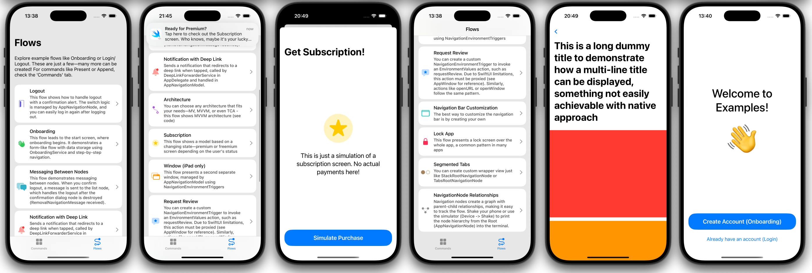
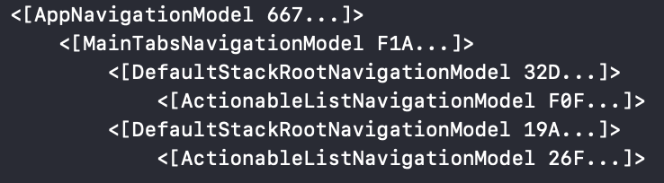

# SwiftUINavigation

Framework for Implementing Clean Navigation in SwiftUI


If anything is unclear, feel free to reach out! I'm happy to clarify or update the documentation to make things more straightforward. 🚀

If you find this repository helpful, feel free to give it a ⭐ or share it with your colleagues 👩‍💻👨‍💻 to help grow the community of developers using this framework.

---------

## Features

- ✅ Handles both simple concepts, like presenting/stack navigation, and complex concepts, such as content-driven (deep linking) and step-by-step navigation ([See Examples app](#Explore-Examples-App))
- ✅ Built on native SwiftUI components, leveraging state-driven architecture in the background
- ✅ Clearly separates the navigation and presentation layers
- ✅ Perfect for everything from simple apps to large-scale projects
- ✅ Manages navigation while leaving the presentation layer architecture entirely up to you—even compatible with TCA ([See Examples app](#Explore-Examples-App))
- ✅ Fully customizable to fit your specific needs
- ✅ Inspired by the well-known Coordinator pattern but without the hassle of manually managing parent-child relationships
- ✅ Supports iOS 16 and later—with zoom transition on the stack available starting from iOS 18  
- ✅ Supports iPad as well – optimized for multi-window experiences 
- ✅ Enables calling environment actions, such as `requestReview`
- ✅ Supports backward compatibility with UIKit via `UIViewControllerRepresentable` – easily present `SFSafariViewController` or `UIActivityViewController`
- ✅ Supports Swift 6 and is concurrency safe




## Core Concepts

The framework consists of two key components: `NavigationNode`, and `NavigationCommand`.

- **NavigationNode**: Think of it as a screen/module or what you might know as a coordinator. These `NavigationNode`s form a navigation graph. Each node stores its state in `NavigationNodeState`. This state is rendered using native SwiftUI mechanisms. When the state changes, navigation occurs. For example, when you change the `presentedNode`, the new node is presented.
  
- **NavigationCommand**: This represents an operation that modifies the navigation state of `NavigationNode`. For example, a `PresentNavigationCommand ` sets the `presentedNode`. These operations can include actions like `.stackAppend(_:animated:)` (push), `.stackDropLast(_:animated:)` (pop), `.present(_:animated:)`, `.dismiss(animated:)`, `.openURL(_)` and more.

To get started, I recommend exploring the [Examples app](#Explore-Examples-App) to get a feel for the framework. Afterward, you can dive deeper [on your own](#Explore-on-Your-Own). For more detailed information, check out the [Documentation](#Documentation).

## Getting Started

### Explore Examples App

I highly recommend starting by exploring the Examples app. The app features many commands that you can use to handle navigation, as well as showcases common flows found in many apps. It includes everything from easy login/logout flows to custom navigation bars with multiple windows.

1. Get the repo

    - Clone the repo: `git clone https://github.com/RobertDresler/SwiftUINavigation`
    - Download the repo (don't forget to **rename** the downloaded folder to `SwiftUINavigation`)

2. Open the app at path `SwiftUINavigation/Examples.xcodeproj`

3. Run the app

    - On simulator
    - On a real device (set your development team)

4. Explore the app


### Explore on Your Own

To get started, first add the package to your project:

- In Xcode, add the package by using this URL: `https://github.com/RobertDresler/SwiftUINavigation` and choose the dependency rule **up to next major version** from `1.4.0`
- Alternatively, add it to your `Package.swift` file: `.package(url: "https://github.com/RobertDresler/SwiftUINavigation", from: "1.4.0")`

Once the package is added, you can copy this code and begin exploring the framework by yourself:

```swift
import SwiftUI
import SwiftUINavigation

@main
struct YourApp: App {
    var body: some Scene {
        WindowGroup {
            NavigationWindow(rootNode: .stacked(HomeNavigationNode()))
        }
    }
}

@NavigationNode
class HomeNavigationNode {

    var body: some View {
        HomeView()
    }

    func showDetail() {
        execute(.present(.sheet(.stacked(DetailNavigationNode()))))
    }

}

struct HomeView: View {

    @EnvironmentNavigationNode private var navigationNode: HomeNavigationNode

    var body: some View {
        VStack {
            Text("Hello world from Home!")
            Button(action: { navigationNode.showDetail() }) {
                Text("Go to Detail")
            }
        }
    }

}

@NavigationNode
class DetailNavigationNode {

    var body: some View {
        DetailView()
    }

}

struct DetailView: View {

    @EnvironmentNavigationNode private var navigationNode: DetailNavigationNode

    var body: some View {
        Text("Hello world from Detail!")
    }

}

```

## Documentation

To see the framework in action, check out the code in the [Examples App](#Explore-Examples-App). If anything is unclear, feel free to reach out! I'm happy to clarify or update the documentation to make things more straightforward. 🚀

### NavigationWindow

The `NavigationWindow` is the top-level hierarchy element. It is placed inside a `WindowGroup` and holds a reference to the root node. Don’t nest one window inside another; use it only at the top level.

### NavigationNode

A `NavigationNode` represents a single node in the navigation graph, similar to what you might know as a Coordinator or Router. The best practice is to have one `NavigationNode` for each module or screen. A `NavigationNode` manages the navigation layer of your app. To use it, use one of the predefined macros like this.

```swift
@NavigationNode
class HomeNavigationNode {
    
    var body: some View {
        HomeView()
    }
    
}
```

It is represented by a `body` property. The code within the `body` can be written using any architecture (MVVM, Composable, or any other of your choice — see [Examples App](#Check-Examples-App)).

You can access the `NavigationNode` from your `View` using the following:

```swift
@EnvironmentNavigationNode private var navigationNode: YourNavigationNode
```

#### Predefined Macros:

- **`@NavigationNode`**  
  The simplest node you’ll use most of the time, especially if your screen doesn’t require any tabs or switch logic.
  
- **`@StackRootNavigationNode`**  
  Represents what you would typically associate with a `NavigationStack` or `UINavigationController`. Most of the time, you don't have to create your own implementation; you can use the predefined `.stacked` / `StackRootNavigationNode` like this:
  
  ```swift
  .stacked(HomeNavigationNode())
  ```
  
  If you want to create your own implementation, you can update the node's body using `body(for:)`.

- **`@TabsRootNavigationNode`**  
  Represents what you would typically associate with a `TabView` or `UITabBarController`. You can create your own implementation of `TabsRootNavigationNode` like this (for more, see [Examples App](#Explore-Examples-App)):
    
```swift
@TabsRootNavigationNode
class MainTabsNavigationNode {

    enum Tab {
        case home
        case settings
    }

    init(initialTab: Tab) {
        state = TabsRootNavigationNodeState(
            selectedTabNodeID: initialTab,
            tabsNodes: [
                DefaultTabNode(
                    id: Tab.home,
                    image: Image(systemName: "house"),
                    title: "Home",
                    navigationNode: .stacked(HomeNavigationNode())
                ),
                DefaultTabNode(
                    id: Tab.settings,
                    image: Image(systemName: "gear"),
                    title: "Settings",
                    navigationNode: .stacked(SettingsNavigationNode())
                )
            ]
        )
    }

    func body(for content: TabsRootNavigationNodeView) -> some View {
        content // Modify default content if needed
    }

}
```

- **`@SwitchedNavigationNode`**    
  Use this macro to create a node that can dynamically switch between different child nodes.  

  This node is useful for scenarios like:  
  - A root node that displays either the tabs root node or the login screen based on whether the user is logged in.  
  - A subscription screen that shows different content depending on whether the user is subscribed.  
  - And more...

  See the example below, or for a practical implementation, check out the [Examples App](#Explore-Examples-App).
  
```swift
class UserService {
    @Published var isUserLogged = false
}

@SwitchedNavigationNode
class AppNode {

    var userService: UserService

    init(userService: UserService) {
        self.userService = userService
    }

    func body(for content: SwitchedNavigationNodeView) -> some View {
        content
            .onReceive(userService.$isUserLogged) { [weak self] in self?.switchNode(isUserLogged: $0) }
    }

    private func switchNode(isUserLogged: Bool) {
        execute(
            .switchNode(
                isUserLogged
                    ? MainTabsNavigationNode(initialTab: .home)
                    : LoginNavigationNode()
            )
        )
    }

}
```

#### Predefined Nodes:

- **`.stacked`/`StackRootNavigationNode`**  
  A generic `@StackRootNavigationNode` that you can use in most cases without needing to create your own. You can create it using static `.stacked` getters.

  ```swift
  NavigationWindow(rootNode: .stacked(HomeNavigationNode()))
  ```
  
  - You can also pass `StackTabBarToolbarBehavior` as an argument like this:  
`.stacked(..., tabBarToolbarBehavior: .hiddenWhenNotRoot(animated: false))`. This will hide the tab bar toolbar when the root view is not visible.
  	 - `.automatic` - Preserves the default behavior.
  	 - `.hiddenWhenNotRoot(animated:)` - Hides the tab bar when the root view is not visible - could be animated or not.
  
- **`SFSafariNavigationNode`**  
  A node that opens a URL in an in-app browser.
  
### NavigationNodeState

Each node maintains its state in the `state: NavigationNodeState` property. This state holds the node’s stored data, such as which node is currently presented or which nodes are in the stack (as in the StackRootNavigationNodeState subclass). The navigation hierarchy is then resolved based on this state.

You can access the `NavigationNodeState` from your `View` using the following:

```swift
@EnvironmentNavigationNodeState private var navigationNodeState: YourNavigationNodeState
```

### NavigationCommand

To perform common navigation actions like append, present, or dismiss, you need to modify the navigation state. In the framework, this is handled using `NavigationCommand`s. These commands allow you to dynamically update the state to reflect the desired navigation flow. Many commands are already predefined within the framework (see [Examples App](#Explore-Examples-App)).

A command is executed on a `NavigationNode` using the `execute(_:)` method:

```swift
@NavigationNode
class HomeNavigationNode {

    ...

    func showDetail() {
        execute(.present(.sheet(.stacked(DetailNavigationNode()))))
    }

}
```

#### Predefined Commands

##### Stack Commands
- **`.stackAppend`/`StackAppendNavigationCommand`**  
  Adds a new node to the stack - you can think of it as a push
- **`.stackDropLast`/`StackDropLastNavigationCommand`**  
  Hides the last `k` nodes in the stack - you can think of it as a pop
- **`.stackDropToRoot`/`StackDropToRootNavigationCommand`**  
  Leaves only the first node in the stack - you can think of it as a pop to root
- **`.stackSetRoot`/`StackSetRootNavigationCommand`**  
  Replaces the root node in the stack
- **`.stackMap`/`StackMapNavigationCommand`**  
  Changes the stack - you can create your own command using this one

##### Presentation Commands
- **`.present`/`PresentNavigationCommand`**  
  Presents a node on the highest node that can present
- **`PresentOnGivenNodeNavigationCommand`**  
  Presents a node on the specified node

##### Dismiss Commands
- **`.dismiss`/`DismissNavigationCommand`**  
  Dismisses the highest presented node
- **`DismissJustFromPresentedNavigationCommand`**  
  Dismisses the node on which it is called, if it is the highest presented node

##### Other Commands
- **`.hide`/`ResolvedHideNavigationCommand`**  
  Dismisses the node if possible, otherwise drops the last node in the stack
- **`.tabsSelectItem`/`TabsSelectItemNavigationCommand`**  
  Changes the selected tab in the nearest tab bar
- **`.switchNode`/`SwitchNavigationCommand`**  
  If the called node is a `SwitchedNavigationNode`, it switches its `switchedNode`
- **`.openWindow`/`OpenWindowNavigationCommand`**  
  Opens a new window with ID
- **`.dismissWindow`/`DismissWindowNavigationCommand`**  
  Closes the window with ID
- **`.handleDeepLink`/`DefaultHandleDeepLinkNavigationCommand`**  
  Handles a deep link on the most appropriate node (see [NavigationDeepLink](#NavigationDeepLink))
- **`.openURL`/`OpenURLNavigationCommand`**  
  Opens a URL using `NavigationEnvironmentTrigger` (see [NavigationEnvironmentTrigger](#NavigationEnvironmentTrigger))

The framework is designed to allow you to easily create your own commands as well (see [Examples App](#Explore-Examples-App)).

### PresentedNavigationNode

Since presenting views using native mechanisms requires separate view modifiers, I introduced the concept of `PresentedNavigationNode`. Instead of presenting the `NavigationNode` directly, you present the `PresentedNavigationNode`, which holds your `NavigationNode` (e.g., `DetailNavigationNode`). This approach also allows you to create custom implementations, such as a photo picker. If you want to present a node, you execute `PresentNavigationCommand` with the `PresentedNavigationNode`.

```swift
@NavigationNode
class HomeNavigationNode {

    ...

    func showDetail() {
	// Present fullScreenCover
        execute(.present(.fullScreenCover(.stacked(DetailNavigationNode()))))
        // Present sheet
        execute(.present(.sheet(.stacked(DetailNavigationNode()))))
        // Present sheet with detail and pushed detail editor
        execute(.present(.sheet(.stacked([DetailNavigationNode(), DetailEditorNavigationNode()])))
        // Present not wrapped in stack
        execute(.present(.sheet(SFSafariNavigationNode(...))))
    }

}
```

#### Predefined PresentedNavigationNodes
- **`.fullScreenCover`/`FullScreenCoverPresentedNavigationNode`**  
  Displays a full-screen modal, similar to `fullScreenCover` in SwiftUI. If you want to wrap a newly presented node into a stack node, use `.stacked` or `StackRootNavigationNode`.
- **`.sheet`/`SheetPresentedNavigationNode`**  
  Displays a sheet, similar to `sheet` in SwiftUI (you can adjust the detents to show it as a bottom sheet). If you want to wrap a newly presented node into a stack node, use `.stacked` or `StackRootNavigationNode`.
- **`.alert`/`AlertPresentedNavigationNode`**  
  Presents a standard `alert`
- **`.confirmationDialog`/`ConfirmationDialogPresentedNavigationNode`**  
  Presents an alert as `actionSheet`

When presenting nodes like `ConfirmationDialogPresentedNavigationNode`, you may want to present it from a specific view, so that on iPad, it appears as a popover originating from that view. To do this, use the `presentingNavigationSource(_:)` modifier to modify the view:

```swift
Button(...) { ... }
    .presentingNavigationSource(id: "logoutButton")
```

Then, when presenting it, pass the 
`sourceID` to the command's `presentedNode`:

```swift
.present(
    .confirmationDialog(
        ...,
        sourceID: "logoutButton"
    )
)
```

You can also define your own custom presentable nodes, such as for handling a `PhotosPicker`. In this case, you need to register these nodes on the `NavigationWindow` using the `registerCustomPresentableNavigationNodes(_:)` method (see [Examples App](#Explore-Examples-App)).

### NavigationMessage

A `NavigationNode` can send a `NavigationMessage` through a message listener. You can add the listener using `onMessageReceived(_:)`/`addMessageListener(_:)`, and then send the message using `sendMessage(_:)`. The recipient can then check which type of message it is and handle it accordingly.

```swift
execute(
    .stackAppend(
        DetailNavigationNode()
            .onMessageReceived { [weak self] in 
                switch message {
                case _ as RemovalNavigationMessage:
                    // Handle RemovalNavigationMessage
                default:
                    break
                } 
            }
    )
)
```

The framework provides a predefined message, `RemovalNavigationMessage`, which is triggered whenever a `NavigationNode` is removed from its `parent`, so you know it is being deallocated, dismissed, or dropped from the stack.

### NavigationDeepLink

Sometimes you need content-driven navigation, for example, when backend data or notifications direct users to different screens. This data is called a `NavigationDeepLink`. The specific screen and how it should be displayed is handled by `NavigationDeepLinkHandler`, which you provide during the initialization of `NavigationWindow`.

If you want a specific node to handle the deep link, execute the `DefaultHandleDeepLinkNavigationCommand`, for example, from the root node. This will route the deep link to the correct node. Alternatively, you can create a custom command for this purpose.

### NavigationEnvironmentTrigger

Sometimes, we need to use `View`'s API, which can only be triggered from the `View` itself via its `EnvironmentValues`. To do this, we can send a `NavigationEnvironmentTrigger` using `sendEnvironmentTrigger(_:)` on a `NavigationNode`. This will invoke the `DefaultNavigationEnvironmentTriggerHandler` which calls the value from `EnvironmentValues`.

#### Predefined triggers
- **`OpenURLNavigationEnvironmentTrigger`**  
  By default, calls `EnvironmentValues.openURL`
- **`OpenWindowNavigationEnvironmentTrigger`**  
  By default, calls `openWindow`
- **`DismissNavigationEnvironmentTrigger`**  
  By default, calls `EnvironmentValues.dismiss`
- **`DismissWindowNavigationEnvironmentTrigger`**  
  By default, calls `EnvironmentValues.dismissWindow`
  
If you want to customize the handler (e.g., sending a custom trigger), subclass `DefaultNavigationEnvironmentTriggerHandler` and set it on a `NavigationWindow` using `navigationEnvironmentTriggerHandler(_:)` (see [Examples App](#Explore-Examples-App)).

### NavigationNodeResolvedView

When creating a custom wrapper view, like in [`SegmentedTabsNavigationNode` in the Examples App](#Explore-Examples-App), use `NavigationNodeResolvedView` to display the node within the view hierarchy (this is e.g. how `StackRootNavigationNode` works internally).

### Custom transitions

Custom transitions like zoom are supported since iOS 18+ for Stack (see [Examples App](#Explore-Examples-App)).

### Debugging

To enable debug printing, set the following:

```swift
NavigationConfig.shared.isDebugPrintEnabled = true
```

By default, this will print the start and finish (deinit) of nodes with their IDs, helping you ensure there are no memory leaks.

```
. [SomeNavigationNode E34...]: Started
. [SomeNavigationNode F34...]: Finished
```

You can also print the debug graph from a given `NavigationNode` and its successors using `printDebugGraph()`. This will help you understand the hierarchy structure.



### Relationships

You can explore the graph using different relationships. It's important to know that the parent/child relationship is handled automatically, so you only need to call commands. This is true unless you're implementing a custom container, in which case you can simply override `childrenPublishers` (see [SegmentedTabsNavigationNode in Examples App](#Explore-Examples-App)).

## FAQ

**Q: Does using `AnyView` cause performance issues?**  

A: Based on my findings, it shouldn't. `AnyView` is used only at the top of the navigation layer, and it doesn't get redrawn unless there's a navigation operation. This behavior is the same whether or not you use `AnyView`.

## Contribution, Issues, & Feature Requests

Contributions are welcome! Feel free to report any issues or request features—I'll be happy to assist!

## Contact

If you need further assistance, feel free to reach out:

- Email: robertdreslerjr@gmail.com
- LinkedIn: [Robert Dresler](https://www.linkedin.com/in/robert-dresler/)

## Support

If this repo has been helpful to you, consider supporting me using the link below:


[](https://bmc.link/robertdresler)

